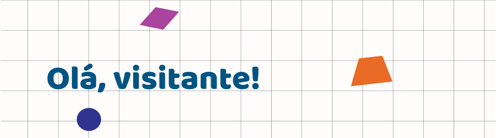

<html>

<head>
  <link href="https://fonts.googleapis.com/css2?family=Baloo+2:wght@500;600;700;800&display=swap" rel="stylesheet">
</head>

<body>
    
    <h1 style="font-family: Baloo 2, cursive"> oi </h1>
</body>

</html>
